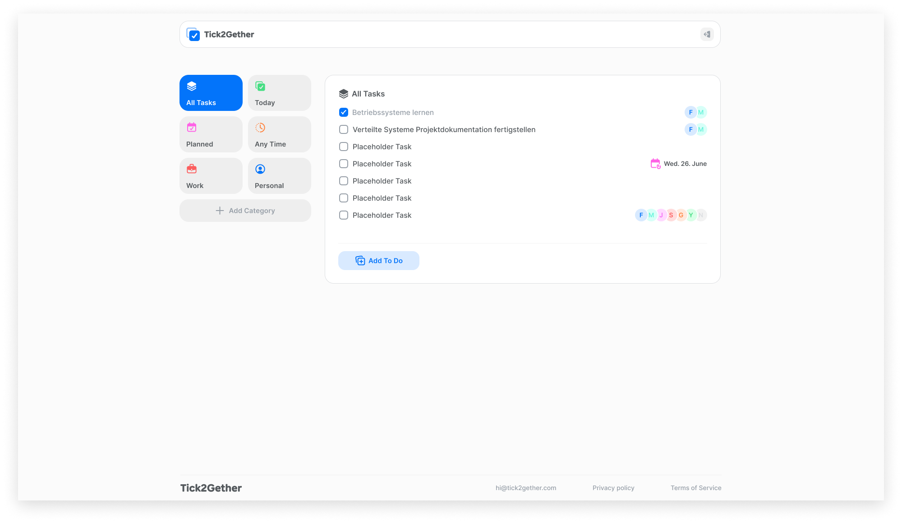

# Tick2Gether

## Beschreibung
**Tick2Gether** ist eine Webanwendung zur Aufgaben- und Teamverwaltung, die Echtzeitkommunikation und intuitive Bedienung kombiniert. Sie richtet sich an Teams und Einzelpersonen, die Aufgaben effizient organisieren und in Echtzeit zusammenarbeiten möchten. Der Fokus liegt auf einer modernen, skalierbaren Architektur und einer benutzerfreundlichen Oberfläche.

## Features
- **Dashboard & ToDo-Bereich**: Übersicht über anstehende Aufgaben und einfache Verwaltung.
- **Kategorien-Modul**: Aufgaben nach Themen gruppieren.
- **Echtzeitkommunikation**: Änderungen werden sofort bei allen Nutzern synchronisiert (WebSockets).
- **Sichere Authentifizierung**: JWT-gestützte Login- und Registrierungssysteme.
- **Geplante Aufgaben**: Deadlines und Planungsdaten zur besseren Organisation.

## Technologie-Stack
- **Frontend**: React
- **Backend**: Spring Boot
- **Echtzeit-Kommunikation**: WebSockets
- **RESTful API**: CRUD-Operationen
- **Datenbank**: MySQL mit JDBC
- **Sicherheit**: JWT-Authentifizierung
